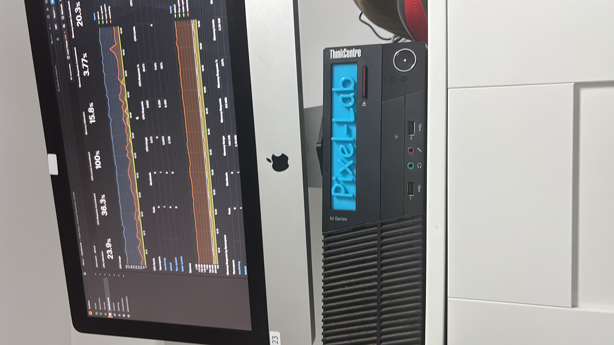

Pixel Lab – Kubernetes Home Lab
Overview
Pixel Lab is a self-hosted Kubernetes home lab designed for experimenting with DevOps tools, GitOps workflows, and cloud-native technologies. Built using K3s and managed with Flux CD, this lab serves as a testing ground for learning and improving Kubernetes administration, CI/CD pipelines, and infrastructure automation.

Features
K3s-based Kubernetes cluster – Lightweight and optimized for home lab environments.
GitOps with Flux CD – Automates deployment and configuration management.
Monitoring & Observability – Includes Grafana for visualization.
Simple & Scalable Structure – Uses a minimalistic Flux repository design for easy expansion.

